Snap Generator for Fusion 360
============================

This is an addin for Autodesk Fusion which generates snap-geometries and merges them
with existing CAD bodies in a simple and convenient way.

Installation
----
Click [HERE](https://github.com/AlfMikael/snap-generator/releases/download/0.2.1/snap-generator-v0.2.1.zip)
to download the latest release.
Unzip and paste the unizipped folder into the Fusion 360 add-ins folder. 
On Windows, it's located at

__%appdata%\Autodesk\Autodesk Fusion 360\API\AddIns__

On Mac, it's at

__~/Library/Application Support/Autodesk/Autodesk Fusion 360/API/AddIns__

In the DESIGN workspace, go to the TOOLS tab and click
ADD-INS. In the window that pops up, click the Add-Ins tab, find the name
in the list, and click _run_. Warning: If you already have an old version running
this needs to be stopped because it can cause issues.

It should now appear in the SOLID tab, under _CREATE_.
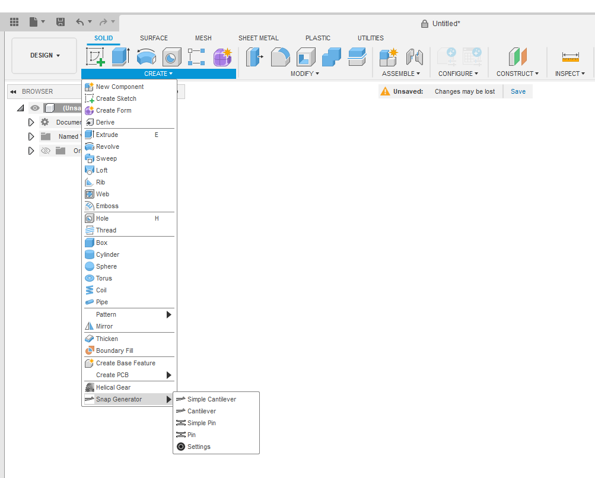

Usage
----
There are currently two features. In addition to the standard feature, each also has a simplified version.
It's a good idea to use the simplified versions first. 

1. A basic Cantilever
2. A Pin consisting of two symmetrical cantilevers on each side.

### Workflow
Adding a snap geometry to your design will typically include these 4 steps.
1. Place a joint-origin in the location you wish to have the snap geometry.
2. Choose the type: Cantilever or Pin, and then fill in the geometric parameters.
3. Fill in your *gap*-parameters, to adjust for 3D-printer inaccuracies.
4. Select the bodies you wish to apply your snap-geometry to, and click OK.

In the case of the Cantilever, this will join the body of the cantilever to the
body of your selected part, and also creating a mating slot in a second part.
The Pin will cut a hole into two parts, while leaving the pin body intact.
Choosing bodies to join or cut is optional for both Pin and Cantilever.

### Joint origin
The snap geometry is positioned and oriented in space by a built-in feature called _joint origin_.
It is found in the ASSEMBLE dropdown.
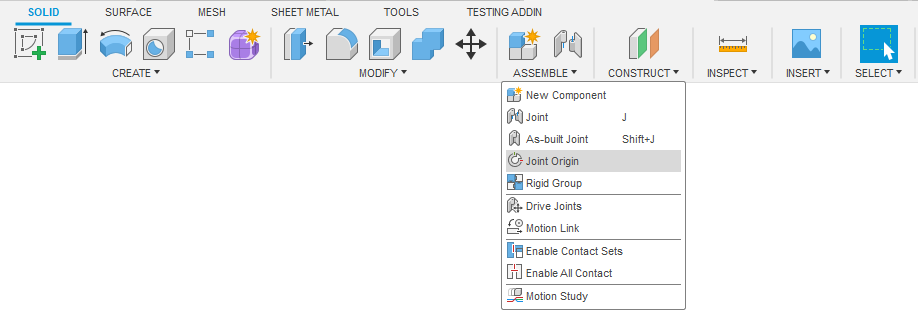

After selecting a starting location, the joint origin can be freely rotated and
moved around. The joint origin has a red, blue and green vector. The shape
will bend in the opposite direction to the green vector. Or, equivalently, the
'nose' of the shape will point in the direction of the green vector. The Pin works similarly.
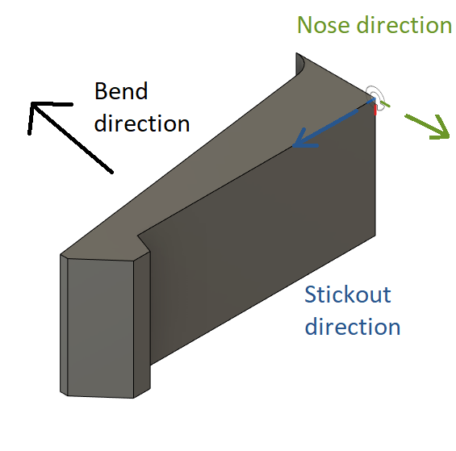

### Profiles and Gap profiles
By clicking on one of the snap features, a _command window_ will pop up and a 
default _profile_ and _gap profile_ is loaded which fills in most of the available parameters.
There are three tabs: The Feature tab is the main one
where you adjust parameters and geometry. It also allows choosing parameters by selecting
predefined profiles. This is especially convenient for the **Pin**, in cases where you have
a customized set of parameters that you wish to reuse in the future. In the *Profile* tab
you can create, delete, and make a specific profile default.
The built-in default profile is equivalent to setting the SIZE-parameter to 10 mm.
The *Gaps* tab does the same thing for gap parameters.

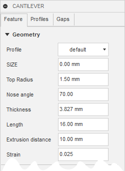

### Geometry

In the __Feature tab__ you can control the geometry by adjusting a handful set of parameters.
The simplified version has a **single** parameter called *SIZE*, which scales
all parameters after a certain formula to get reasonable geometries. The
values are hidden from the command window to not overwhelm the user with too many options.
The *SIZE* parameter is also available in the standard versions, in which case
the values become visible. Setting any parameter to extremely large or small
may result in no part being generated. Parameters are explained in the sections for Pin and 
Cantilever.

### Cutting slots and Gaps
It is possible to select _Bodies to cut_, 
which will cause the selected bodies to have material removed to make a 'slot'
for the shape to 'snap into'. The gap-parameters allow you to correct for
inaccuracies in the manufacturing process. This is especially important for FFF 
(fused filament fabrication). The specific parameters are explained in the sections
for Pin and Cantilever. They work a little differently for each.

## The Pin
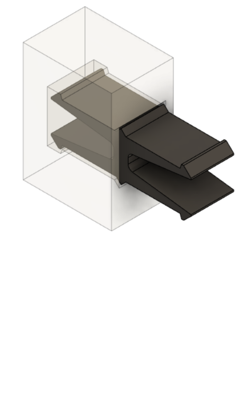 
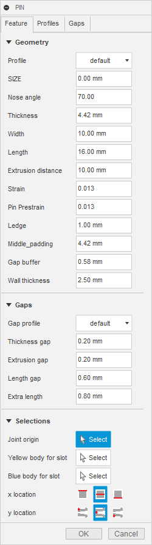 

The Pin is a standalone snap-geometry, and my preferred go-to attaching two components together. There are two main benefits to using a pin.
1. It eliminates the issue of having to reprint, because the gap parameters are wrong. This
is because the gap parameters are **applied to the pin**, not the slotted part. Which means that
after you have slotted the part, and you find that the pin doesn't fit, you may adjust only
the gap parameters, and reprint a new pin that fits better.
2. It allows the snap-geometry to be printed in its optimal orientation. A Pin or Cantilever
that is printed "pointing upwards" from the build plate, will usually have a disappointing performance.
It will be susceptible to deformation, fracture and especially fatigue failure. 

Generating a pin will result in **4 bodies**.
1. The Pin body itself
2. A Subtraction body
3. Addition body 1
4. Addition body 2

The subtraction body is what creates the slot for the Pin to fit into. The addition bodies create
scaffolding around the pin, should the part that is being slotted not have enough material for
the slot. When selecting the bodies to create slots into, the ordering matters. For that reason, there
are some illustrative lines that protrude from the Pin to assist with identifying which part is which.

 

### Strain and Prestrain
When each cantilever leg of the Pin gets pushed (in the intended direction), a strain develops
in the material. When this reaches the region of 0.03 to 0.05 (3-5%), most thermoplastics will either
deform or break. The maximum strain that develops in the part gets determined by the nose height.
This parameter is not available. Rather, you may supply a desired strain, at which point
the corresponding nose height which would cause that level of strain is calculated and applied.
The total strain may be separated into two parts: strain + prestrain. When the part has slid 
completely into the slot, it will still be in a state of strain. This is referred to as the 
pre-strain. This is displayed in figure 1. The Pin head is displaced a distance determined by
the Prestrain from it's neutral (strain-free) position. In figure 2, you can see that for the Pin
to be in a neutral position, it would have to penetrate into the slot wall.

When starting out, it may be confusing to see the (imaginary) overlap in figure 2. This merely appears like
an overlap, because the leg of the Pin is in an unnatural position. When it is in its correct position  (figure 1),
the gap disappears.

*Fig 1: How it will actually look when pin is inserted*

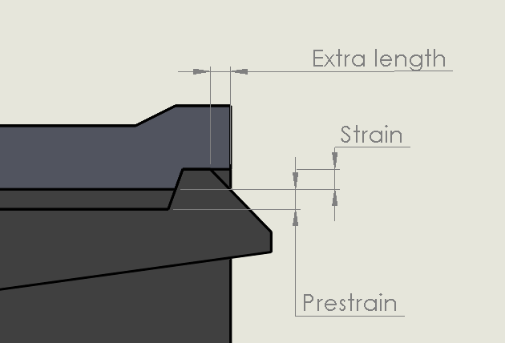

*Fig 2: The way it looks in Fusion*

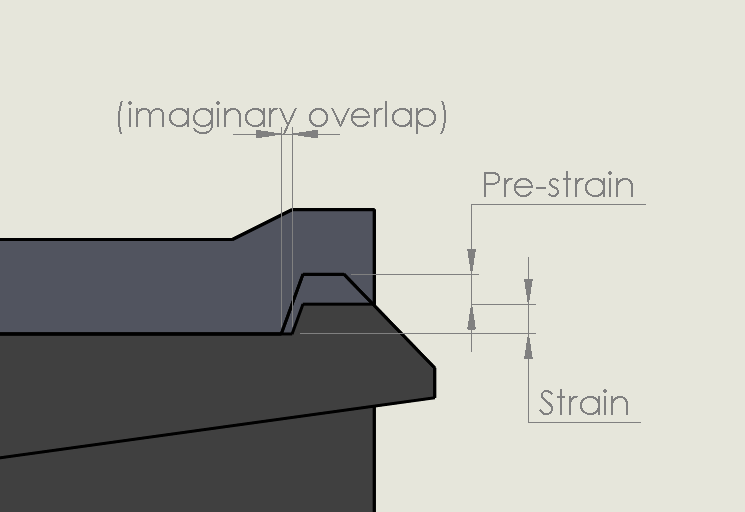

### Pin gaps
As previously mentioned, the gap parameters are applied to the Pin, not the slot. The *thickness gap*
and the *extrusion gap* is easy to visualize, see figure 3. The *length gap* is harder to visualize because
of the pre-strain, but it is simply an offset from the nose and the "notch" that it hooks onto.
In practice, that means elongating the leg to achieve this effect. The *extra length* adds some material
at the end of the slot, as seen in figure 1.

### Parameter overview

*Fig 3: Pin parameters*

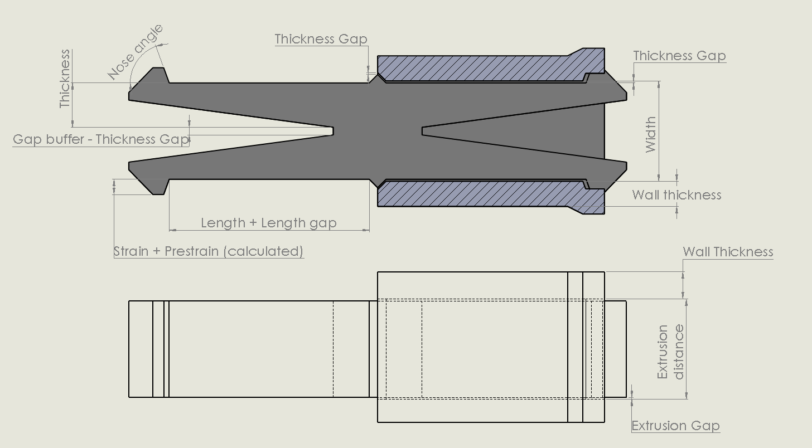

## The cantilever
This is one of the most fundamental and commonly used geometries for snap fits. But 
* The gap parameters will influence only the mating slot,
* If you don't select a _Body to join_, a new component gets created.

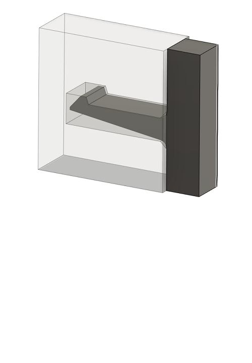 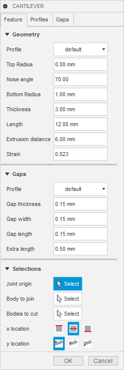  

Parameters:
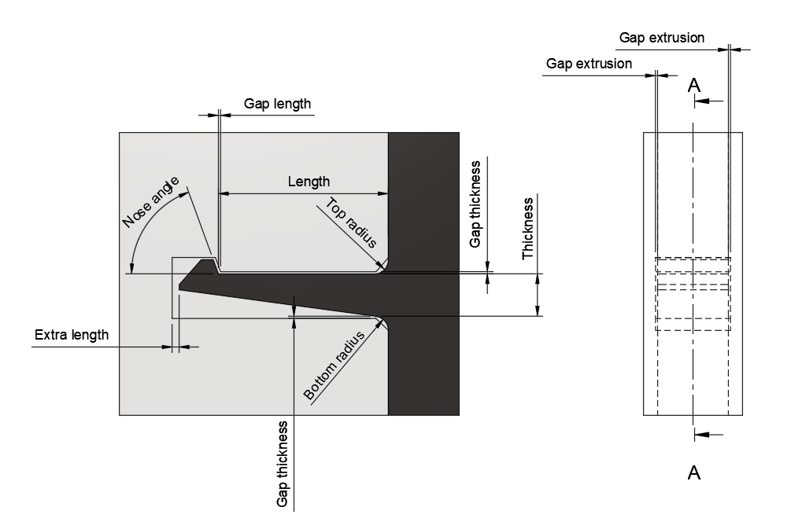 

