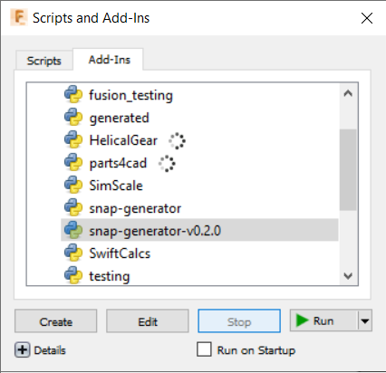
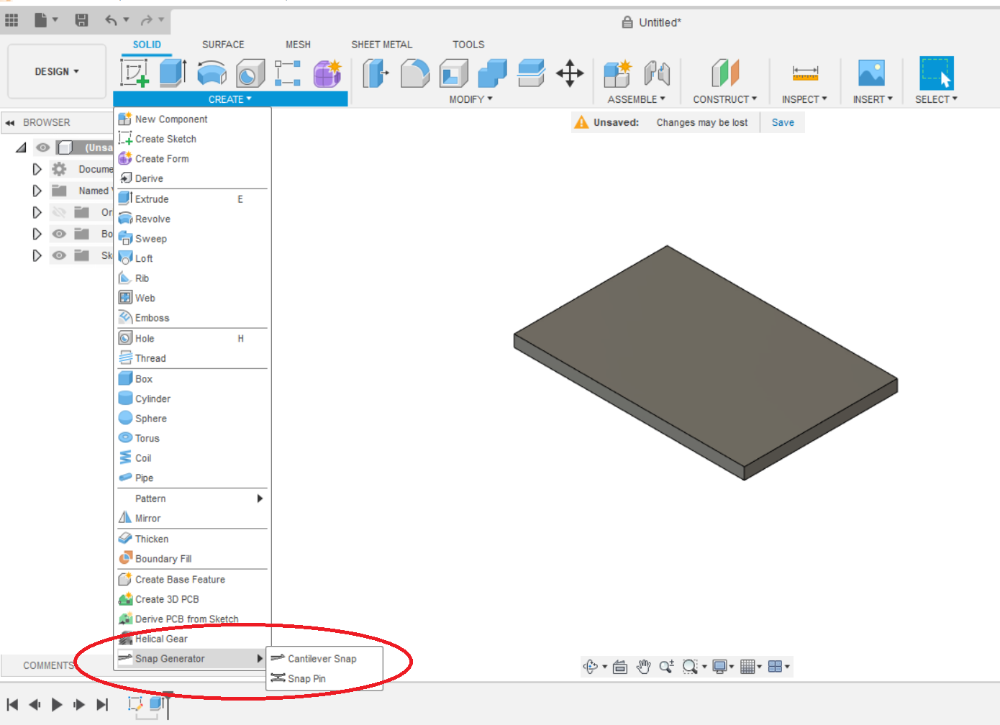

Snap Generator for Fusion 360
============================

This is an addin for Autodesk Fusion 360 which generates snap-geometries from 
user input.

Installation
------------
Since this tool is intended for users that may not be familiar with version 
control systems, here's a step by step by step method to perform the installation
in a good way. There is also a quick and dirty way which will work, but makes 
updating cumbersome. It is mentioned at the end.

For additional information or if you're having trouble, or are using mac,
you can check the [official support page](https://knowledge.autodesk.com/support/fusion-360/troubleshooting/caas/sfdcarticles/sfdcarticles/How-to-install-an-ADD-IN-and-Script-in-Fusion-360.html).

### Step 1
Create a github account if you don't already have one.

### Step 2
Download [Github Desktop](https://desktop.github.com) for windows and
install it, then open it and sign in to your account.

### Step 4
Click "Clone a repository from the internet", then go to the "URL" tab.
Use the following URL: https://github.com/AlfMikael/Snap-Generator
For the local path, you should use the specific folder that Fusion 360 expects
addins to be in.
For windows, this folder is: 
%appdata%\Autodesk\Autodesk Fusion 360\API\AddIns

For mac, this folder is:
~/Library/Application Support/Autodesk/Autodesk Fusion 360/API/AddIns

If you cut and paste this into the "local path", you may get an error, but
if you first click "choose," you can paste it in there directly. Afterwards, 
click "clone."

Remember that you can use Github Desktop to update the add-in when updates are
released.

### Step 5
Now it should be possible to activate the addin. In Fusion 360, in the design
workspace, go to TOOLS - ADD-INS. Then navigate to the Add-Ins tab. 

"snap_generator" is now hopefully in
the list. Select it and click "run." Now go back to the SOLID environment and
confirm that the icon has popped up. 

### Method 2 (the quick and dirty way)
On this page, by clicking the green "Code" button, you can download this project
as a zip file. After that, click on the folder "apper" and download that project
as well. Unzip both projects and then copy the contents of the apper project into
the "apper" folder in the Snap Generator folder. Then copy the entire Snap-Geometry
folder into the addins-folder of Fusion 360.
For windows, this folder is: 
%appdata%\Autodesk\Autodesk Fusion 360\API\AddIns

For mac, this folder is:
~/Library/Application Support/Autodesk/Autodesk Fusion 360/API/AddIns

Then perform step 5.

Usage
----
There are two snap features currently available (with a few more planned).
1. A single cantilever
2. A pin with two cantilevers on each side.

### The command window
By clicking on one of the snap features, a _command window_ will pop up and a 
default _profile_ is loaded which fills in most of the available parameters.
In the __Feature tab__ you can adjust the parameters, but be aware that there are limits to which 
values are allowed, to prevent errors. If a limit is crossed, then nothing gets
generated. The thing that is generated will be hereby referred to as __the shape__. 
It is possible to select _Bodies to cut_, 
which will cause the selected bodies to have material removed to make a 'slot'
for the shape to 'snap into'. It is possible to adjust the difference between
the shape and the slot by setting _gap parameters_. The size difference between the pin and
slot can be adjusted in 3 dimensions, but this is implemented differently in
the different snap features. In the case of the single cantilever, the adjustments
are all done to the slot, but in the case of the pin, the adjustments change the
pin itself.

In the __Profiles__ tab, profiles can be created, overwritten and made into the
default profile. The __Gaps__ tab works the same way.

### Joint origin
The shape can be positioned and oriented in space by a _joint origin_, which
is a built-in feature. It is found in the ASSEMBLE dropdown.

After selecting a starting location, the joint origin can be freely rotated and
moved around. The joint origin has a red, blue and green vector. The shape
will bend in the opposite direction to the green vector. Or, equivalently, the
'nose' of the shape will point in the direction of the green vector.

## The cantilever
This is one of the most fundamental and commonly used geometries for snap fits.
* The gap parameters will influence only the mating slot,
* If you don't select a _Body to join_, a new component gets created.

   

Parameters:
 

## The pin
There are two main benefits to using a pin. The first is that it almost 
eliminates issues of fitting because of wrong gaps. It's easy to experiment with
different gap parameters even after the parts have been printed (or manufactured
in a different way). Only the pins need to be remade. The second is that for 3D
printing, the pins can always be printed in the ideal orientation, because
there is no attached part that may need to be printed differently.

There is a special parameter called __SIZE__. Setting this will change every
other parameter as a function of size alone, except strain. The functions are 
different because not every property should scale in the same way. **To start out, 
I recommend to focus on adjusting only the size and strain**.

  
SIZE doesn't follow to any actual standards, but works like this:
  size = 10mm, will set _extrusion distance_ and _width_ to 10mm. Then it will
  make a compromise between getting radius close to 1.5mm, maintaining
  a 0.6mm buffer for gap thickness, and maximising thickness.

   

Parameters:

Compatibility
-------------